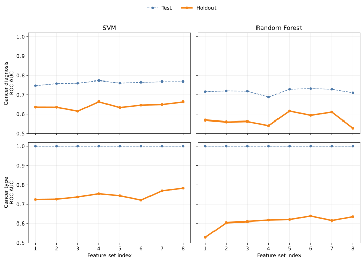

# Cancer detection with gut microbiomes using a DNA language model

## Introduction

For `cancer_diagnosis` each dataset has two labels (cancer or healthy).
The controlled experimental conditions within a given study allow the model to learn patterns in sequences that distinguish between cancer and healthy samples.
Although these distinguishing patterns are small (e.g. changes in species abundance) they represent biological signal that may transfer to new datasets.

For `cancer_type` each dataset has a single label (all breast or all colorectal),
so the model inevitably learns study-level confounders rather than pure biological signal.
These study-level differences impart large signals in the sequences (e.g. different species and regions of the 16S gene)
that likely overwhelm the biological differences between cancer types.
This is why we expect `cancer_type` to be the *easier* task for in-study test data but the *harder* task for holdout data from unseen studies.

The first reads in a FASTA are more likely to carry consistent study-specific artifacts
(adapter remnants, library prep signatures, quality patterns from the sequencer).
A model trained on these reads could achieve artificially high holdout AUC if holdout studies share similar sequencing protocols with development studies.

## Methods

### Data sources

Each sample corresponds to a sequencing run with multiple 16S rRNA gene sequences.
We collected sequencing runs from different studies (four for breast cancer and four for colorectal cancer).
Studies were only included if cancer/healthy labels were available.
We stored the SRA Run accessions (starting with SRR, ERR, or DRR) and study metadata in the repository and downloaded each run’s read archive from NCBI.

### Preprocessing

We normalized sample labels from the sources using a restricted set of labels: healthy, breast cancer, colorectal cancer, and benign.
The benign category contains adenomas and benign colon polyps and breast ductal carcinoma in-situ (DCIS).
Samples labeled breast cancer includes invasive tumors and those labeled colorectal cancer includes carcinoma.
All benign samples and non-fecal samples in some studies were kept in our data files for auditability but were excluded from training.

We divided studies into two groups: studies reserved for external evaluation (holdout) and studies used for model development.
Runs in holdout studies were excluded from the stratified development assignment.
Among development studies only, we assigned each sequencing run to stratified training, validation, or test sets in a 70:15:15 ratio.
We defined those assignments in advance from version-controlled study lists and per-study sample tables,
so they did not depend on the order in which derived feature files were later produced.

We held the validation set fixed (no cross-validation) so that we could use the same development splits when training the language model
(expensive compute limited us to a single validation set) and this classical baseline.
The same run-level split was used across downstream tasks, including cancer versus healthy prediction on all samples and
breast versus colorectal prediction restricted to cancer-positive samples.

### Classification using run-level tetramer frequencies

We calculated tetramer frequencies for each run by counting 4-mers within each sequence,
summing counts over all sequences in the run, then converting those counts to percentages so each run is described by 256 frequency features.

For the baseline, we used majority-class prediction.

For KNN, we applied a centered log-ratio transform (CLR), standardized the CLR coordinates, then applied PCA.
PCA candidate sizes stepped down from the largest feasible rank (up to 256) by successive halves,
keeping only sizes for which the leading components explained at least 90% of the variance on the training fold.
We tuned the PCA size, the number of neighbors, and the distance weights by grid search on the validation split only.

For random forest, we used the same CLR and standardization but did not use PCA. We tuned the number of trees (200 or 500),
the maximum depth of trees (unlimited depth or a cap of 10), and the minimum number of training samples required to form a leaf (1 or 2),
again using only the validation split.

For SVM, we used the same centered log-ratio transform, standardization, and PCA construction as for KNN (including the same PCA candidate sizes and the rule that each candidate retained at least 90% of the variance on the training fold).
We fit a support vector machine with an RBF kernel and jointly tuned the PCA component count, the penalty parameter C, and the kernel width parameter gamma (scikit-learn’s *scale* versus *auto* settings), using only the validation split.

After choosing hyperparameters on the validation split, we fit each final pipeline on the training split.

### Classification using cluster abundance profiles

Run-level tetramer features summarize each sample with a single average profile and therefore do not directly capture
how different sequence types are distributed within a run.
To preserve this within-run compositional structure, we used unsupervised clustering followed by cluster abundance profiles (UC/CAP),
a reference-free and alignment-free approach.

Because the sequence-level table is large, we first fit the unsupervised clustering model using only sequences from runs in the training split,
with at most a fixed number of sequences per training run.
For each selected sequence, we computed a 256-dimensional tetramer composition vector,
then applied principal component analysis (PCA) and retained components that explained 95% of cumulative variance.
We then fit k-means in this reduced space to obtain K centroids that define a sequence codebook.

To construct run-level features, we applied the same PCA transformation and centroid assignments without refitting the unsupervised model,
using up to a larger per-run sequence budget for every run that entered the sequence-level table, including validation, test, and holdout runs.
We counted cluster memberships within each run and normalized by the number of assigned sequences, yielding a K-dimensional cluster abundance profile for each run.
These CAP vectors were then used as the feature matrix for supervised classification for both binary tasks
(cancer versus healthy and breast versus colorectal), with the downstream classifier selected separately.

### Classification using HyenaDNA sequence modeling

We trained HyenaDNA directly on run-level sequence data to test an end-to-end sequence model.
For each run, we read the FASTA file and split its sequences into a fixed number of non-overlapping sets.
Each set was packed to the model length limit and tokenized at the DNA character level.
Datasets were saved to disk so training runs could reuse cached tensors instead of rebuilding the dataset each time.

We initialized HyenaDNA from pretrained weights, used its classification head, and selected model size (for example 1k or 32k context),
pooling mode, learning rate, batch size, number of epochs, and whether to freeze the backbone through YAML configuration.
Because each run can produce multiple sequence sets, training loss was computed across all valid sets from each run.
For evaluation, we converted set-level outputs to one run-level prediction by aggregating logits across sets (mean or max).
We then computed ROC AUC on the same test and holdout splits as used in the tetramer and UC/CAP analyses.

## Results

We defined two binary classification tasks: cancer vs healthy (diagnosis) and breast vs colorectal cancer (cancer type).
Performance metrics (AUC - area under the receiver operating characteristic curve) are reported below for each task and model on the test and holdout splits.
The sections are for different features used for classification: tetramer frequencies based on simple run-level aggregation and cluster abundance profiles derived from sequence-level unsupervised clustering.

### Tetramer-based classifiers

Table 1 summarizes ROC AUC on the test and holdout splits for each task for four models: a majority-class baseline, K nearest neighbors (KNN), a support vector machine (SVM), and random forest.

<!-- classifier-table-1 -->
<table>
<thead>
<tr>
<th rowspan="2">Model</th>
<th colspan="2">Cancer diagnosis AUC</th>
<th colspan="2">Cancer type AUC</th>
</tr>
<tr>
<th>Test</th><th>Holdout</th><th>Test</th><th>Holdout</th>
</tr>
</thead>
<tbody>
<tr>
<td>Majority class</td><td>0.500</td><td>0.500</td><td>0.500</td><td>0.500</td>
</tr>
<tr>
<td>KNN</td><td>0.652</td><td>0.563</td><td>0.959</td><td>0.407</td>
</tr>
<tr>
<td>SVM</td><td>0.725</td><td>0.596</td><td>1.000</td><td>0.484</td>
</tr>
<tr>
<td>Random Forest</td><td>0.701</td><td>0.541</td><td>0.986</td><td>0.532</td>
</tr>
</tbody>
</table>

<!-- /classifier-table-1 -->

For both tasks, all models outperform the majority-class baseline on the test split, especially for the cancer type prediction task.
The picture looks different on the holdout split.
Here, models show modest gains over the baseline for cancer diagnosis, while all models except for RF score below the baseline for cancer type prediction.
While SVM is the model with the best performance across tasks in the test split, only RF scores above the baseline in both holdout splits.

### UC/CAP-based classifiers

We explored different settings for *n*UC (number of sequences from each run used to build unsupervised clusters), *K* (number of clusters retained), and *n*CAP (number of sequences from each run assigned to cluster centroids), summarized in Table 2.

| Feature set | *n*UC | *K* | *n*CAP |
|-|-|-|-|
| 1 | 1000 | 2000 | 5000 |
| 2 | 2000 | 2000 | 5000 |
| 3 | 1000 | 5000 | 5000 |
| 4 | 2000 | 5000 | 5000 |
| 5 | 1000 | 2000 | 10000 |
| 6 | 2000 | 2000 | 10000 |
| 7 | 1000 | 5000 | 10000 |
| 8 | 2000 | 5000 | 10000 |

For cancer diagnosis, SVM shows higher test and holdout AUC than random forest across all eight UC/CAP feature sets (Figure 1).
For cancer type prediction, both models show near-perfect in-study test performance, but holdout values drop sharply, especially for random forest.
Even with these drops, holdout AUC remains generally stable across feature sets, with SVM showing greater stability than random forest.

Table 3 lists AUC values for each model across tasks and splits (test and holdout) for the UC/CAP feature set with *n*UC = 2000, *K* = 5000, and *n*CAP = 10000.

<!-- classifier-table-3 -->
<table>
<thead>
<tr>
<th rowspan="2">Model</th>
<th colspan="2">Cancer diagnosis AUC</th>
<th colspan="2">Cancer type AUC</th>
</tr>
<tr>
<th>Test</th><th>Holdout</th><th>Test</th><th>Holdout</th>
</tr>
</thead>
<tbody>
<tr>
<td>KNN</td><td>0.719</td><td>0.571</td><td>0.998</td><td>0.500</td>
</tr>
<tr>
<td>SVM</td><td>0.769</td><td>0.664</td><td>1.000</td><td>0.783</td>
</tr>
<tr>
<td>Random Forest</td><td>0.710</td><td>0.527</td><td>1.000</td><td>0.634</td>
</tr>
</tbody>
</table>

<!-- /classifier-table-3 -->

For cancer diagnosis, SVM has the best holdout performance.
For cancer type prediction, SVM has the best holdout performance, and random forest also scores above baseline.
KNN remains on par with the baseline (majority-class) prediction, while SVM and random forest stay far below their near-perfect in-study test performance.

### Classification with HyenaDNA

We fine-tuned the 32k max-length HyenaDNA pre-trained model.
Due to hardware limitations (16 GB GPU) we used smaller max lengths: 1024, 2048, and 4096 (1k, 2k, and 4k).
For each run, we used five sets of sequences; each set fits into the configured max length.
We took consecutive sequences from the beginning of the FASTA files without shuffling to build three run tensor caches for 1k, 2k, and 4k max length.
Then, we took systematic samples for experimental runs, also using 1k, 2k, and 4k max length, from all available run tensor caches.
For example, the 1k cache was ony used for a 1k experiment, but the 4k cache was used for 1k, 2k, and 4k experiments.
This yielded six (1 + 2 + 3) cache-experiment combinations.
When the experimental max length is shorter than the cache max length, the sets are more spaced-out (some sequences between sets are unused). 
This way we investigated whether predictive performance is affected by sequence proximity.

Table 4 lists the AUC values for each cache-experimental combination across tasks and splits (test or holdout).

<!-- classifier-table-4 -->
<table>
<thead>
<tr>
<th colspan="2">max_length</th>
<th colspan="2">Cancer diagnosis AUC</th>
<th colspan="2">Cancer type AUC</th>
</tr>
<tr>
<th>cache</th><th>model</th><th>Test</th><th>Holdout</th><th>Test</th><th>Holdout</th>
</tr>
</thead>
<tbody>
<tr>
<td>1k</td><td>1k</td><td>0.629</td><td>0.564</td><td>0.863</td><td>0.585</td>
</tr>
<tr>
<td>2k</td><td>1k</td><td>0.643</td><td>0.519</td><td>0.941</td><td>0.573</td>
</tr>
<tr>
<td>2k</td><td>2k</td><td>0.581</td><td>0.514</td><td>0.938</td><td>0.034</td>
</tr>
<tr>
<td>4k</td><td>1k</td><td>0.636</td><td>0.535</td><td>0.953</td><td>0.621</td>
</tr>
<tr>
<td>4k</td><td>2k</td><td>0.618</td><td>0.517</td><td>0.953</td><td>0.550</td>
</tr>
<tr>
<td>4k</td><td>4k</td><td>0.592</td><td>0.504</td><td>0.924</td><td>0.600</td>
</tr>
</tbody>
</table>
<!-- /classifier-table-4 -->

## Discussion

Scores are consistently lower on the holdout splits, emphasizing over-optimistic metrics computed from in-study test splits.

The high test AUC scores >0.9 for cancer type prediction makes sense because the datasets for breast and colorectal cancer come from different studies.
The sample collection and sequencing is different from study to study, so the models have an easy time fitting to these differences.
In contrast, the lower test AUC scores near 0.7 for cancer diagnosis is expected for models that are challenged with distinguishing between cancer and healthy samples from the same studies.

Because the models learned differences between studies rather than biologically meaningful differences between cancer types,
cancer type prediction has a huge performance drop for holdout data from studies the models haven't been trained on.
On the other hand, the performance is lower in the holdout split but often remains above baseline for cancer diagnosis,
suggesting that the models learned biological differences between cancer and healthy samples that transfer to new studies.

Comparing the holdout splits in Tables 1 and 3, UC/CAP shows an overall advantage over run-level tetramer frequencies, most clearly for cancer type and for SVM.
Although SVM and random forest show near-perfect in-study test performance for cancer type prediction in both pipelines,
only UC/CAP yields substantial improvements above baseline on holdout studies.
This result illustrates the challenge of transferring learned patterns to new datasets and highlights SVM as the strongest model in our current set.
